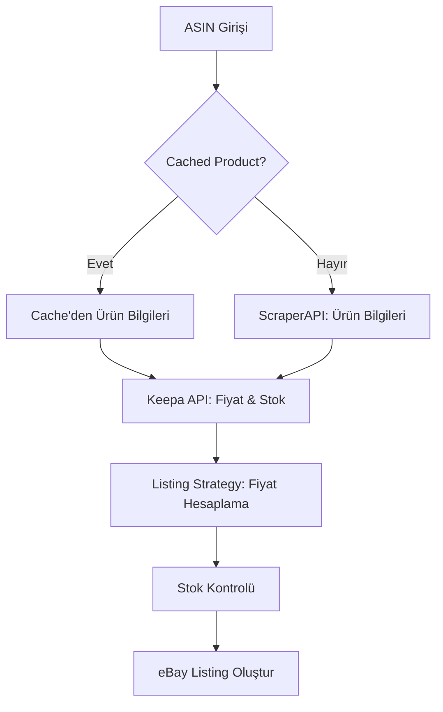

# Keepa API Entegrasyonu - Fiyat ve Stok Yönetimi

## Genel Bakış

Zonds platformunda ürün listeleme işlemi sırasında **fiyat ve stok bilgileri tamamen Keepa API üzerinden** alınmaktadır. Bu yaklaşım, Amazon'daki güncel fiyat ve stok durumunu gerçek zamanlı olarak takip etmemizi sağlar.

## Mimari

### Veri Kaynakları

1. **ScraperAPI** (Ürün Bilgileri)

   - Ürün başlığı (title)
   - Açıklama (description)
   - Görseller (images)
   - Özellikler (features)
   - Teknik özellikler (specs)
   - Marka, kategori, boyutlar vb.

2. **Keepa API** (Fiyat ve Stok)

   - Güncel Amazon fiyatı
   - Stok durumu
   - Para birimi

3. **Listing Settings Group** (Kullanıcı Tercihleri)
   - Stok adedi tercihi (`defaultQuantity`)
   - Repricing stratejisi
   - eBay ücretleri

## İş Akışı

### 1. Ürün Listeleme Süreci



### 2. Stok Hesaplama Mantığı

```typescript
const userPreferredStock = group.stock?.defaultQuantity || 1;
const amazonStock = product.stock ?? 0; // Keepa'dan gelen

if (amazonStock >= userPreferredStock) {
  ebayQuantity = userPreferredStock;
} else {
  ebayQuantity = 0; // Overselling riskini önle
}
```

**Örnekler:**

- Amazon'da 15 adet var, kullanıcı 5 adet tercih ediyor → eBay'de 5 adet listelenir
- Amazon'da 3 adet var, kullanıcı 5 adet tercih ediyor → eBay'de 0 adet (stok yok)
- Amazon'da stok yok → eBay'de 0 adet

### 3. Fiyat Hesaplama

1. **Keepa'dan Güncel Fiyat**: Amazon'daki anlık fiyat alınır
2. **Repricing Stratejisi**: Kullanıcının belirlediği kar marjı uygulanır
3. **eBay Ücretleri**: eBay komisyonu ve vergiler eklenir
4. **Final Fiyat**: eBay'de listelenecek nihai fiyat

```typescript
// Keepa'dan gelen fiyat
const amazonPrice = keepaData.price; // örn: 29.99 USD

// Repricing stratejisi (örn: %20 kar marjı)
const targetPrice = amazonPrice * 1.2; // 35.99 USD

// eBay ücretleri eklenerek final fiyat
const finalPrice = applyFees(targetPrice, fees); // örn: 38.50 USD
```

## Keepa API Detayları

### Endpoint

```
GET https://api.keepa.com/product
```

### Parametreler

```typescript
{
  key: KEEPA_API_KEY,
  domain: 1,        // 1 = amazon.com
  asin: "B08N5WRWNW",
  stats: 1,         // Stok bilgisi için gerekli
  history: 0,       // Bandwidth tasarrufu
  offers: 0         // Bandwidth tasarrufu
}
```

### Stok Çıkarma Mantığı

Keepa API'den stok bilgisi şu kaynaklardan alınır:

1. **availabilityAmazon** (Durum Kodu)

   - `0` = Stokta
   - `1` = Stok Yok
   - `2` = Satıcılardan Temin Edilebilir

2. **stats.current Array İndeksleri**

   - `stats.current[3]` = Amazon stock
   - `stats.current[11]` = 3rd party (New) stock

3. **Fallback Mekanizması**
   - Stokta ise: `10` (muhafazakar tahmin)
   - Stok yoksa: `0`

### Kod Örneği

```typescript
private extractStock(product: any): number {
  const availabilityStatus = product.stats?.availabilityAmazon;

  if (availabilityStatus === 1) {
    return 0; // Açıkça stok yok
  }

  const amazonStock = product.stats?.current?.[3];
  const newStock = product.stats?.current?.[11];

  if (typeof amazonStock === 'number' && amazonStock > 0) {
    return amazonStock;
  }
  if (typeof newStock === 'number' && newStock > 0) {
    return newStock;
  }

  if (availabilityStatus === 0) {
    return 10; // Stokta ama miktar bilinmiyor
  }

  return 0;
}
```

## Token Kullanımı

**Keepa API Token Maliyeti:**

- 1 ürün fiyat + stok sorgusu = **1 token**

**Optimizasyon:**

- `stats: 1` → Sadece güncel durum (history yok)
- `history: 0` → Geçmiş fiyat verisi yok
- `offers: 0` → Marketplace teklifleri yok

## Hata Yönetimi

### Keepa API Başarısız Olursa

```typescript
const keepaData = await keepaService.getPriceAndStock(asin);

if (keepaData) {
  // Keepa verisi kullan
  productData.price = keepaData.price;
  productData.stock = keepaData.stock;
} else {
  // ScraperAPI verisine fallback
  logger.warn('Keepa failed, using ScraperAPI data');
  // productData.price ve stock zaten ScraperAPI'den gelmiş
}
```

### Cached Product için Refresh

Cached (önbelleğe alınmış) ürünler için bile Keepa'dan güncel fiyat/stok alınır:

```typescript
if (existingProduct) {
  productData = existingProduct.data; // Cached data

  // Fiyat ve stok'u Keepa'dan güncelle
  const keepaData = await keepaService.getPriceAndStock(asin);
  if (keepaData) {
    productData.price = keepaData.price;
    productData.stock = keepaData.stock;
  }
}
```

## Test Senaryoları

### Senaryo 1: Normal Listeleme

```
ASIN: B08N5WRWNW
Keepa Fiyat: $29.99
Keepa Stok: 15
User Preferred Stock: 5
→ eBay'de 5 adet, hesaplanmış fiyatla listelenir
```

### Senaryo 2: Düşük Stok

```
ASIN: B07XYZ123
Keepa Fiyat: $49.99
Keepa Stok: 2
User Preferred Stock: 5
→ eBay'de 0 adet (overselling riski)
```

### Senaryo 3: Keepa Başarısız

```
ASIN: B09ABC456
Keepa API: FAILED
ScraperAPI Fiyat: $39.99
ScraperAPI Stok: 10
User Preferred Stock: 3
→ ScraperAPI verisi kullanılır, 3 adet listelenir
```

### Senaryo 4: Cached Product

```
ASIN: B08CACHED (DB'de mevcut)
Cached Title: "Wireless Mouse"
Cached Images: [...]
Keepa Fiyat: $19.99 (güncel)
Keepa Stok: 8
→ Cached ürün bilgileri + Keepa güncel fiyat/stok
```

## Monitoring ve Logging

### Log Seviyeleri

```typescript
// INFO: Normal akış
logger.log('Fetching Keepa data for ASIN: B08N5WRWNW');

// DEBUG: Detaylı veri
logger.debug('Keepa data: price=29.99, stock=15');

// WARN: Fallback durumları
logger.warn('Keepa failed, using ScraperAPI data');

// ERROR: Kritik hatalar
logger.error('Keepa API error: Timeout');
```

## Gelecek Geliştirmeler

1. **Repricing Automation**: Keepa'dan periyodik fiyat güncellemeleri
2. **Stock Sync**: Otomatik stok senkronizasyonu
3. **Price Alerts**: Fiyat değişikliği bildirimleri
4. **Multi-Domain Support**: Farklı Amazon marketleri (UK, DE, vb.)
5. **Historical Data**: Fiyat geçmişi analizi

## Referanslar

- [Keepa API Documentation](https://keepa.com/#!discuss/t/product-object/116)
- [Keepa Stats Object](https://keepa.com/#!discuss/t/stats-object/117)
- [Product Object Fields](https://keepa.com/#!discuss/t/products/110)
