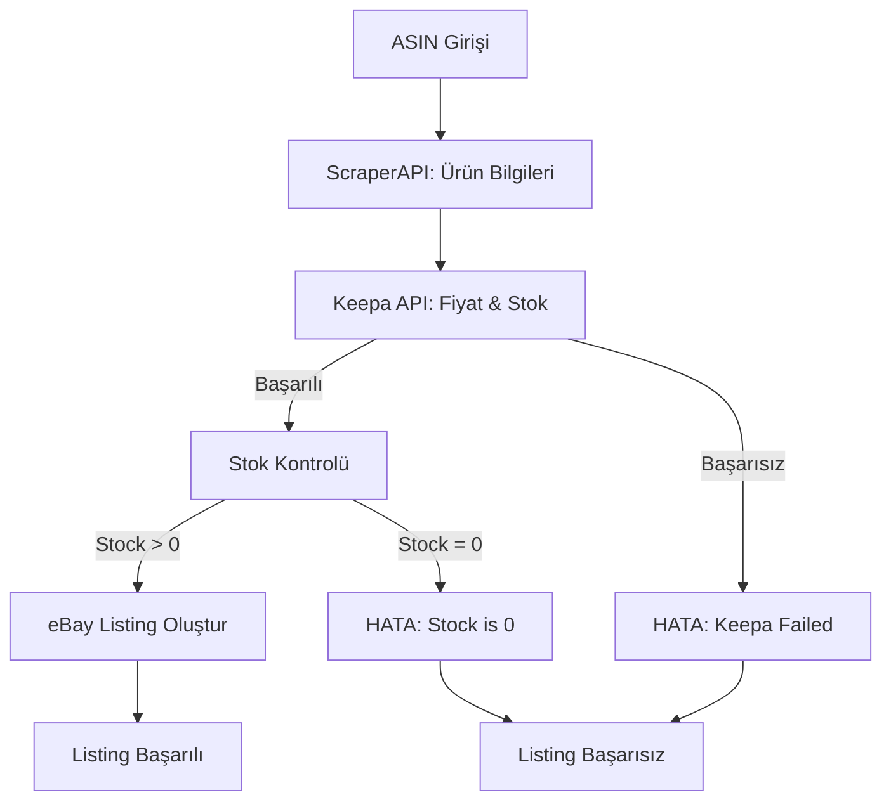

# Keepa API Entegrasyonu - Yeni Gereksinimler

## ✅ Yapılan Değişiklikler (23 Ocak 2026)

### 1. Keepa API Parametreleri Düzeltildi

**Sorun**: Keepa API "invalidParameter" hatası veriyordu.

**Çözüm**:

```typescript
// ❌ Önceki (Hatalı)
params: {
  stats: 1,      // Boolean gibi görünüyor
  history: 0,    // Keepa bu parametreyi kabul etmiyor
  offers: 0      // Keepa bu parametreyi kabul etmiyor
}

// ✅ Şimdi (Doğru)
params: {
  stats: 90,     // Son 90 günün istatistikleri
  // history ve offers parametreleri kaldırıldı
}
```

### 2. Keepa Başarısız Olursa Listing Başarısız Olur

**Önceki Davranış**: Keepa başarısız olursa ScraperAPI verisi kullanılıyordu (fallback).

**Yeni Davranış**: Keepa başarısız olursa listing ekleme işlemi tamamen başarısız olur.

```typescript
// ❌ Önceki
async getPriceAndStock(): Promise<KeepaProductResponse | null> {
  try {
    // ...
  } catch (error) {
    return null; // Fallback için null döndür
  }
}

// ✅ Şimdi
async getPriceAndStock(): Promise<KeepaProductResponse> {
  try {
    // ...
  } catch (error) {
    throw new Error(`Failed to fetch Keepa data: ${error.message}`);
  }
}
```

**Sonuç**:

- ✅ Keepa başarılı → Listing devam eder
- ❌ Keepa başarısız → Listing başarısız olur, hata mesajı gösterilir

### 3. Stok 0 İse Listing Eklenmez

**Yeni Kontrol**: `prepareListingData` sonrası stok kontrolü eklendi.

```typescript
// 3.5. Validate stock - Do not list products with 0 stock
if (listingData.quantity === 0) {
  throw new Error(
    `Cannot list ASIN ${asin}: Stock is 0. ` +
      `Amazon stock (${productData.stock}) is less than user preferred quantity.`
  );
}
```

**Stok 0 Olma Nedenleri**:

1. Amazon'da stok yok (Keepa stock = 0)
2. Amazon stoğu kullanıcının tercih ettiği miktardan az

**Örnek**:

- Amazon Stock: 3
- User Preferred: 5
- Result: Quantity = 0 → Listing BAŞARISIZ ❌

## 📊 Yeni İş Akışı



## 🔍 Hata Mesajları

### Keepa API Hatası

```
Failed to fetch Keepa data for B0BSLXLH3T: Request failed with status code 400
```

**Çözüm**:

- API key'i kontrol edin
- Token limitini kontrol edin
- ASIN'in geçerli olduğundan emin olun

### Stok 0 Hatası

```
Cannot list ASIN B0BSLXLH3T: Stock is 0.
Amazon stock (2) is less than user preferred quantity.
Please adjust your listing settings group stock preferences or wait for Amazon to restock.
```

**Çözüm**:

1. Listing Settings Group'ta `defaultQuantity` değerini düşürün (örn: 1)
2. Amazon'da stok artana kadar bekleyin
3. Farklı bir ASIN deneyin

## 🎯 Test Senaryoları

### Senaryo 1: Keepa Başarılı, Yeterli Stok ✅

```
ASIN: B08N5WRWNW
Keepa: SUCCESS (price=29.99, stock=15)
User Preferred: 5
→ Listing BAŞARILI, eBay Quantity = 5
```

### Senaryo 2: Keepa Başarılı, Yetersiz Stok ❌

```
ASIN: B08N5WRWNW
Keepa: SUCCESS (price=29.99, stock=2)
User Preferred: 5
→ Listing BAŞARISIZ: "Stock is 0"
```

### Senaryo 3: Keepa Başarısız ❌

```
ASIN: B08N5WRWNW
Keepa: FAILED (400 error)
→ Listing BAŞARISIZ: "Failed to fetch Keepa data"
```

### Senaryo 4: Keepa Başarılı, Düşük Tercih ✅

```
ASIN: B08N5WRWNW
Keepa: SUCCESS (price=29.99, stock=2)
User Preferred: 1
→ Listing BAŞARILI, eBay Quantity = 1
```

## ⚙️ Önerilen Ayarlar

### Yüksek Başarı Oranı İçin

```json
{
  "stock": {
    "defaultQuantity": 1
  }
}
```

- ✅ Amazon'da 1+ stok varsa listeler
- ✅ Maksimum ürün çeşitliliği
- ⚠️ Sık stok güncellemesi gerekebilir

### Dengeli Yaklaşım

```json
{
  "stock": {
    "defaultQuantity": 3
  }
}
```

- ✅ Orta seviye stok güvenliği
- ✅ İyi ürün çeşitliliği
- ✅ Makul stok yönetimi

### Güvenli Yaklaşım

```json
{
  "stock": {
    "defaultQuantity": 10
  }
}
```

- ✅ Maksimum stok güvenliği
- ⚠️ Daha az ürün listelenebilir
- ✅ Minimum stok riski

## 📝 Loglar

### Başarılı Listing

```
[ScraperApiService] ScraperAPI response for B08N5WRWNW: ...
[ListingProcessorService] Fetching current price and stock from Keepa for ASIN B08N5WRWNW
[KeepaService] Fetching Keepa data for ASIN: B08N5WRWNW (Domain: 1)
[KeepaService] Keepa data for B08N5WRWNW: price=29.99, stock=15
[ListingProcessorService] Keepa data received: price=29.99 USD, stock=15
[ListingStrategyService] Stock calculation: Amazon stock=15, User preferred=5, Final quantity=5 (IN STOCK)
[EbayService] Creating eBay listing (REST) for user ...
```

### Başarısız Listing (Keepa Hatası)

```
[ScraperApiService] ScraperAPI response for B0BSLXLH3T: ...
[ListingProcessorService] Fetching current price and stock from Keepa for ASIN B0BSLXLH3T
[KeepaService] Fetching Keepa data for ASIN: B0BSLXLH3T (Domain: 1)
[KeepaService] Keepa API error for B0BSLXLH3T: Request failed with status code 400
[ListingProcessorService] Error processing ASIN B0BSLXLH3T: Failed to fetch Keepa data
```

### Başarısız Listing (Stok 0)

```
[KeepaService] Keepa data for B08XYZ: price=19.99, stock=2
[ListingStrategyService] Stock calculation: Amazon stock=2, User preferred=5, Final quantity=0 (OUT OF STOCK)
[ListingProcessorService] Error processing ASIN B08XYZ: Cannot list ASIN: Stock is 0
```

## 🚀 Sonraki Adımlar

1. ✅ Keepa API parametreleri düzeltildi
2. ✅ Fallback mantığı kaldırıldı
3. ✅ Stok 0 kontrolü eklendi
4. 🔄 Yeni bir ürün ekleyerek test edin
5. 📊 Logları kontrol edin
6. ⚙️ Gerekirse `defaultQuantity` ayarlayın

## 💡 İpuçları

1. **Keepa Token Yönetimi**: Her ürün için 1 token harcanır. Token limitinizi kontrol edin.
2. **Stok Tercihi**: Başlangıçta `defaultQuantity: 1` ile başlayın, sonra artırın.
3. **Hata İzleme**: Logları düzenli kontrol edin, Keepa hatalarını takip edin.
4. **ASIN Seçimi**: Popüler, stoklu ürünler seçin.
